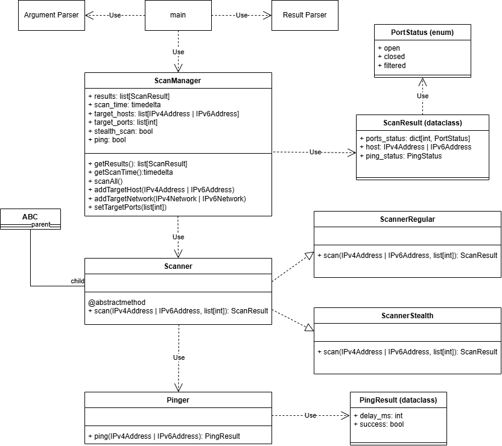

# Port Scanner

## Description

This is a stripped, shameless clone of nmap for a university project.
Please don't judge us, it really is a lot of pressure.

## Development

Before pushing, please check your code with following:

``` 
mypy src
pylint --rcfile pylint.conf src
```

You can auto format your code with:

```
ruff format src
```

## How it works

### Class diagram

